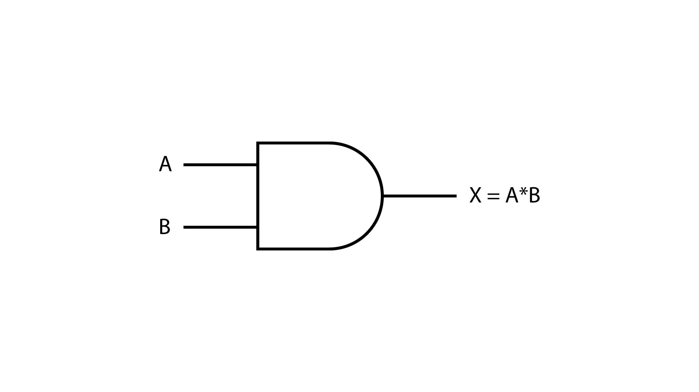
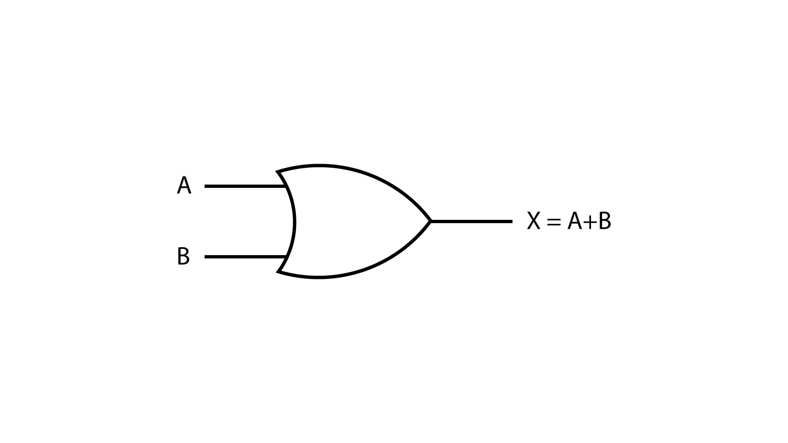
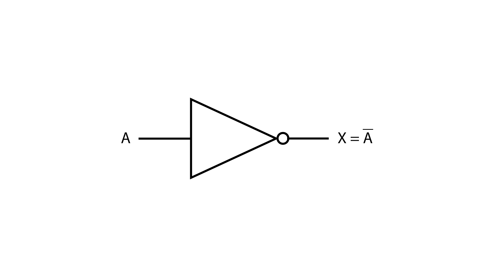
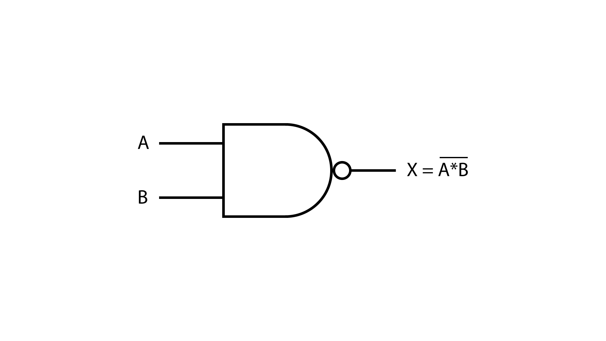
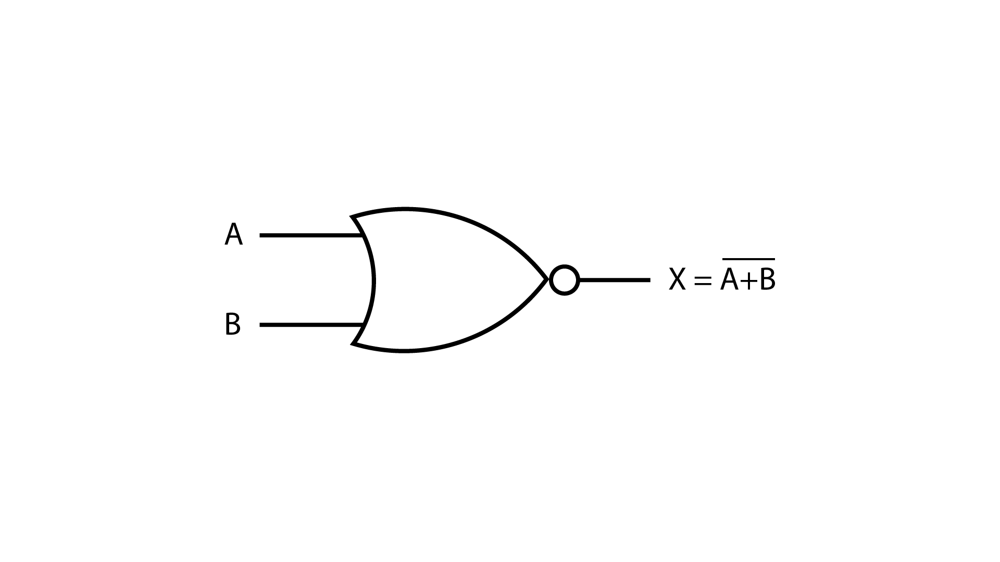
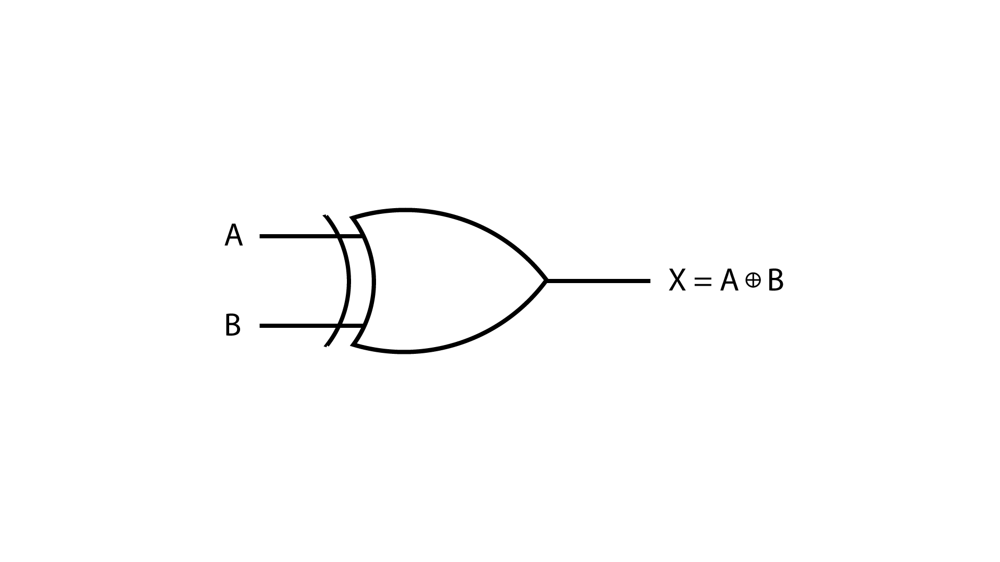
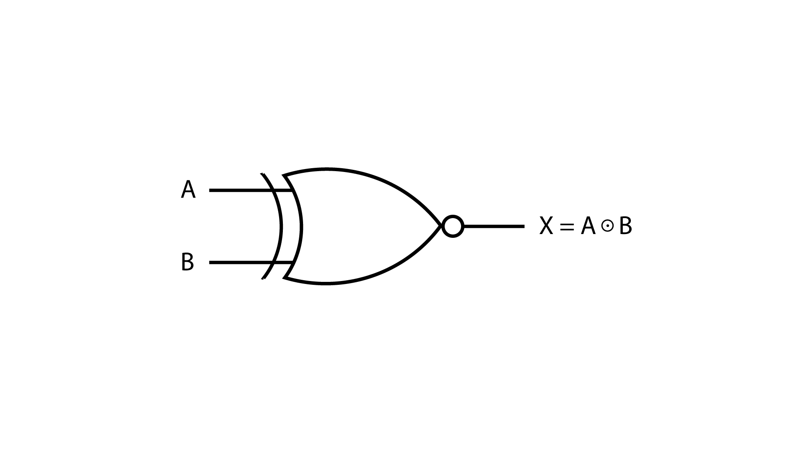

# Portas Lógicas e Tabelas-Verdade

Portas lógicas são blocos fundamentais de qualquer sistema digital; é através delas que um computador, por exemplo, consegue realizar operações matemáticas e processar instruções.

> Portas lógicas tomam decisões baseadas na Álgebra Booleana e são responsáveis pelas operações lógicas que formam a base dos circuitos digitais.

Seu funcionamento é bem simples: recebem um ou mais sinais de entrada e produzem um sinal de saída, conforme a lógica específica de cada porta. Cada porta lógica possui uma função bem definida que é representada por um símbolo específico em diagramas elétricos. Portas lógicas residem em circuitos integrados (CIs), que são componentes com milhões de portas lógicas encapsuladas que processam sinais elétricos e, no caso de CIs complexos (como processadores), têm como função controlar e gerenciar um sistema eletrônico.

A maior parte dos circuitos integrados é feita com silício que, por ser um excelente semicondutor, permite maior controle da eletricidade. Além disso, existem questões de abundância e preço sobre esse material que o tornam o ideal para a construção desses circuitos.

---

Existem 7 portas lógicas fundamentais, que são a base de toda a eletrônica digital. A partir dessas portas, engenheiros combinam milhões delas para criar qualquer circuito imaginável, desde uma calculadora simples até o processador de um computador. Junto com as portas lógicas, temos as tabelas-verdade, que são ferramentas essenciais para entender a lógica e o comportamento de cada porta. Tabelas-verdade listam todas as combinações possíveis de entrada e as respectivas saídas, o que facilita a análise e a compreensão de circuitos digitais.

> Nas tabelas que serão representadas, A e B são referentes às entradas e X será o valor de saída.

---

## Porta lógica **AND**:
Trata-se de uma das portas fundamentais dos circuitos digitais. Ela realiza a operação de multiplicação lógica (ou conjunção lógica).

**Regra**: a saída será verdadeira (1) se, e somente se, todas as entradas forem verdadeiras (1).

### Tabela da verdade

<table style="width: 100%; max-width: 500px; text-align: center; border-collapse: collapse; margin: 20px auto; font-family: sans-serif;">
  <thead>
    <tr style="background-color: #707070; color: #ffffff;">
      <th style="padding: 12px; border: 1px solid #888888;">Entrada A</th>
      <th style="padding: 12px; border: 1px solid #888888;">Entrada B</th>
      <th style="padding: 12px; border: 1px solid #888888;">Saída X</th>
    </tr>
  </thead>
  <tbody>
    <tr style="background-color: white; color: #000;">
      <td style="padding: 12px; border: 1px solid #888888;">0</td>
      <td style="padding: 12px; border: 1px solid #888888;">0</td>
      <td style="padding: 12px; border: 1px solid #888888; font-weight: bold;">0</td>
    </tr>
    <tr style="background-color: white; color: #000;">
      <td style="padding: 12px; border: 1px solid #888888;">0</td>
      <td style="padding: 12px; border: 1px solid #888888;">1</td>
      <td style="padding: 12px; border: 1px solid #888888; font-weight: bold;">0</td>
    </tr>
    <tr style="background-color: white; color: #000;">
      <td style="padding: 12px; border: 1px solid #888888;">1</td>
      <td style="padding: 12px; border: 1px solid #888888;">0</td>
      <td style="padding: 12px; border: 1px solid #888888; font-weight: bold;">0</td>
    </tr>
    <tr style="background-color: white; color: #000;">
      <td style="padding: 12px; border: 1px solid #888888;">1</td>
      <td style="padding: 12px; border: 1px solid #888888;">1</td>
      <td style="padding: 12px; border: 1px solid #888888; font-weight: bold;">1</td>
    </tr>
  </tbody>
</table>

---

## Porta lógica **OR**
Também uma das portas lógicas fundamentais. Ela realiza a operação de adição lógica (disjunção lógica).

**Regra**: a saída será verdadeira (1) se pelo menos uma das entradas for verdadeira (1).

### Tabela da verdade

<table style="width: 100%; max-width: 500px; text-align: center; border-collapse: collapse; margin: 20px auto; font-family: sans-serif;">
  <thead>
    <tr style="background-color: #707070; color: #ffffff;">
      <th style="padding: 12px; border: 1px solid #888888;">Entrada A</th>
      <th style="padding: 12px; border: 1px solid #888888;">Entrada B</th>
      <th style="padding: 12px; border: 1px solid #888888;">Saída X</th>
    </tr>
  </thead>
  <tbody>
    <tr style="background-color: white; color: #000;">
      <td style="padding: 12px; border: 1px solid #888888;">0</td>
      <td style="padding: 12px; border: 1px solid #888888;">0</td>
      <td style="padding: 12px; border: 1px solid #888888; font-weight: bold;">0</td>
    </tr>
    <tr style="background-color: white; color: #000;">
      <td style="padding: 12px; border: 1px solid #888888;">0</td>
      <td style="padding: 12px; border: 1px solid #888888;">1</td>
      <td style="padding: 12px; border: 1px solid #888888; font-weight: bold;">1</td>
    </tr>
    <tr style="background-color: white; color: #000;">
      <td style="padding: 12px; border: 1px solid #888888;">1</td>
      <td style="padding: 12px; border: 1px solid #888888;">0</td>
      <td style="padding: 12px; border: 1px solid #888888; font-weight: bold;">1</td>
    </tr>
    <tr style="background-color: white; color: #000;">
      <td style="padding: 12px; border: 1px solid #888888;">1</td>
      <td style="padding: 12px; border: 1px solid #888888;">1</td>
      <td style="padding: 12px; border: 1px solid #888888; font-weight: bold;">1</td>
    </tr>
  </tbody>
</table>

---

## Porta lógica **NOT**
É conhecida também como a porta lógica inversora, e é uma das portas fundamentais mais simples. Ela realiza a operação de negação lógica.

**Regra**: produz uma saída verdadeira (1) apenas se sua entrada for falsa (0) e produz uma saída falsa (0) apenas se sua entrada for verdadeira (1).

### Tabela da verdade

<table style="width: 100%; max-width: 500px; text-align: center; border-collapse: collapse; margin: 20px auto; font-family: sans-serif;">
  <thead>
    <tr style="background-color: #707070; color: #ffffff;">
      <th style="padding: 12px; border: 1px solid #888888;">Entrada A</th>
      <th style="padding: 12px; border: 1px solid #888888;">Saída X</th>
    </tr>
  </thead>
  <tbody>
    <tr style="background-color: white; color: #000;">
      <td style="padding: 12px; border: 1px solid #888888;">0</td>
      <td style="padding: 12px; border: 1px solid #888888; font-weight: bold;">1</td>
    </tr>
    <tr style="background-color: white; color: #000;">
      <td style="padding: 12px; border: 1px solid #888888;">1</td>
      <td style="padding: 12px; border: 1px solid #888888; font-weight: bold;">0</td>
    </tr>
  </tbody>
</table>

---

## Porta lógica **NAND**
É a combinação de uma porta AND seguida de uma porta NOT. Seu nome é uma abreviação de "NOT AND". Ela realiza operações de negação da operação AND.

**Regra**: sua saída é falsa (0) somente quando todas as entradas são verdadeiras (1).

### Tabela da verdade

<table style="width: 100%; max-width: 500px; text-align: center; border-collapse: collapse; margin: 20px auto; font-family: sans-serif;">
  <thead>
    <tr style="background-color: #707070; color: #ffffff;">
      <th style="padding: 12px; border: 1px solid #888888;">Entrada A</th>
      <th style="padding: 12px; border: 1px solid #888888;">Entrada B</th>
      <th style="padding: 12px; border: 1px solid #888888;">Saída X</th>
    </tr>
  </thead>
  <tbody>
    <tr style="background-color: white; color: #000;">
      <td style="padding: 12px; border: 1px solid #888888;">0</td>
      <td style="padding: 12px; border: 1px solid #888888;">0</td>
      <td style="padding: 12px; border: 1px solid #888888; font-weight: bold;">1</td>
    </tr>
    <tr style="background-color: white; color: #000;">
      <td style="padding: 12px; border: 1px solid #888888;">0</td>
      <td style="padding: 12px; border: 1px solid #888888;">1</td>
      <td style="padding: 12px; border: 1px solid #888888; font-weight: bold;">1</td>
    </tr>
    <tr style="background-color: white; color: #000;">
      <td style="padding: 12px; border: 1px solid #888888;">1</td>
      <td style="padding: 12px; border: 1px solid #888888;">0</td>
      <td style="padding: 12px; border: 1px solid #888888; font-weight: bold;">1</td>
    </tr>
    <tr style="background-color: white; color: #000;">
      <td style="padding: 12px; border: 1px solid #888888;">1</td>
      <td style="padding: 12px; border: 1px solid #888888;">1</td>
      <td style="padding: 12px; border: 1px solid #888888; font-weight: bold;">0</td>
    </tr>
  </tbody>
</table>

---

## Porta lógica **NOR**
É a combinação de uma porta OR seguida de uma porta NOT. Seu nome é a abreviação de "NOT OR". Ela realiza a operação de negação da operação OR.

**Regra**: a saída é verdadeira (1) somente quando todas as entradas são falsas (0).

### Tabela da verdade

<table style="width: 100%; max-width: 500px; text-align: center; border-collapse: collapse; margin: 20px auto; font-family: sans-serif;">
  <thead>
    <tr style="background-color: #707070; color: #ffffff;">
      <th style="padding: 12px; border: 1px solid #888888;">Entrada A</th>
      <th style="padding: 12px; border: 1px solid #888888;">Entrada B</th>
      <th style="padding: 12px; border: 1px solid #888888;">Saída X</th>
    </tr>
  </thead>
  <tbody>
    <tr style="background-color: white; color: #000;">
      <td style="padding: 12px; border: 1px solid #888888;">0</td>
      <td style="padding: 12px; border: 1px solid #888888;">0</td>
      <td style="padding: 12px; border: 1px solid #888888; font-weight: bold;">1</td>
    </tr>
    <tr style="background-color: white; color: #000;">
      <td style="padding: 12px; border: 1px solid #888888;">0</td>
      <td style="padding: 12px; border: 1px solid #888888;">1</td>
      <td style="padding: 12px; border: 1px solid #888888; font-weight: bold;">0</td>
    </tr>
    <tr style="background-color: white; color: #000;">
      <td style="padding: 12px; border: 1px solid #888888;">1</td>
      <td style="padding: 12px; border: 1px solid #888888;">0</td>
      <td style="padding: 12px; border: 1px solid #888888; font-weight: bold;">0</td>
    </tr>
    <tr style="background-color: white; color: #000;">
      <td style="padding: 12px; border: 1px solid #888888;">1</td>
      <td style="padding: 12px; border: 1px solid #888888;">1</td>
      <td style="padding: 12px; border: 1px solid #888888; font-weight: bold;">0</td>
    </tr>
  </tbody>
</table>

---

## Porta lógica **XOR**
É a porta Exclusive OR (OU Exclusivo), que realiza a operação de disjunção exclusiva. Essa operação exclui (por isso exclusivo) a possibilidade de ambas as situações acontecerem ao mesmo tempo. Ela elimina a opção onde tudo é verdadeiro. Se um fato acontece, o outro é obrigatoriamente descartado.

**Regra**: sua saída é verdadeira (1) somente quando as entradas são diferentes entre si. Se forem iguais, a saída será falsa (0).

### Tabela da verdade

<table style="width: 100%; max-width: 500px; text-align: center; border-collapse: collapse; margin: 20px auto; font-family: sans-serif;">
  <thead>
    <tr style="background-color: #707070; color: #ffffff;">
      <th style="padding: 12px; border: 1px solid #888888;">Entrada A</th>
      <th style="padding: 12px; border: 1px solid #888888;">Entrada B</th>
      <th style="padding: 12px; border: 1px solid #888888;">Saída X</th>
    </tr>
  </thead>
  <tbody>
    <tr style="background-color: white; color: #000;">
      <td style="padding: 12px; border: 1px solid #888888;">0</td>
      <td style="padding: 12px; border: 1px solid #888888;">0</td>
      <td style="padding: 12px; border: 1px solid #888888; font-weight: bold;">0</td>
    </tr>
    <tr style="background-color: white; color: #000;">
      <td style="padding: 12px; border: 1px solid #888888;">0</td>
      <td style="padding: 12px; border: 1px solid #888888;">1</td>
      <td style="padding: 12px; border: 1px solid #888888; font-weight: bold;">1</td>
    </tr>
    <tr style="background-color: white; color: #000;">
      <td style="padding: 12px; border: 1px solid #888888;">1</td>
      <td style="padding: 12px; border: 1px solid #888888;">0</td>
      <td style="padding: 12px; border: 1px solid #888888; font-weight: bold;">1</td>
    </tr>
    <tr style="background-color: white; color: #000;">
      <td style="padding: 12px; border: 1px solid #888888;">1</td>
      <td style="padding: 12px; border: 1px solid #888888;">1</td>
      <td style="padding: 12px; border: 1px solid #888888; font-weight: bold;">0</td>
    </tr>
  </tbody>
</table>

---

## Porta lógica **XNOR**
É a combinação de uma porta XOR seguida por uma porta NOT. Ela realiza a operação de equivalência lógica.

**Regra**: se ambas as entradas forem iguais, o resultado é verdadeiro (1); se forem diferentes, é falso (0).

### Tabela da verdade

<table style="width: 100%; max-width: 500px; text-align: center; border-collapse: collapse; margin: 20px auto; font-family: sans-serif;">
  <thead>
    <tr style="background-color: #707070; color: #ffffff;">
      <th style="padding: 12px; border: 1px solid #888888;">Entrada A</th>
      <th style="padding: 12px; border: 1px solid #888888;">Entrada B</th>
      <th style="padding: 12px; border: 1px solid #888888;">Saída X</th>
    </tr>
  </thead>
  <tbody>
    <tr style="background-color: white; color: #000;">
      <td style="padding: 12px; border: 1px solid #888888;">0</td>
      <td style="padding: 12px; border: 1px solid #888888;">0</td>
      <td style="padding: 12px; border: 1px solid #888888; font-weight: bold;">1</td>
    </tr>
    <tr style="background-color: white; color: #000;">
      <td style="padding: 12px; border: 1px solid #888888;">0</td>
      <td style="padding: 12px; border: 1px solid #888888;">1</td>
      <td style="padding: 12px; border: 1px solid #888888; font-weight: bold;">0</td>
    </tr>
    <tr style="background-color: white; color: #000;">
      <td style="padding: 12px; border: 1px solid #888888;">1</td>
      <td style="padding: 12px; border: 1px solid #888888;">0</td>
      <td style="padding: 12px; border: 1px solid #888888; font-weight: bold;">0</td>
    </tr>
    <tr style="background-color: white; color: #000;">
      <td style="padding: 12px; border: 1px solid #888888;">1</td>
      <td style="padding: 12px; border: 1px solid #888888;">1</td>
      <td style="padding: 12px; border: 1px solid #888888; font-weight: bold;">1</td>
    </tr>
  </tbody>
</table>

---