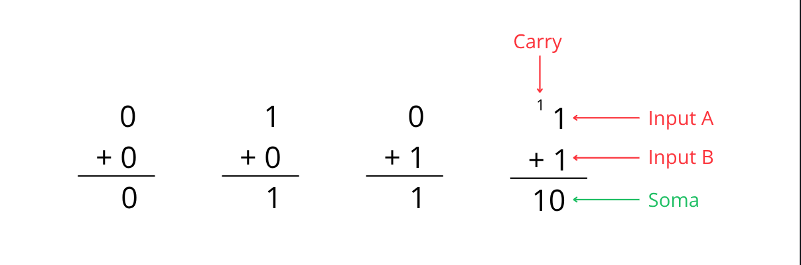
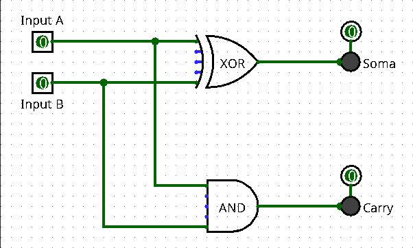
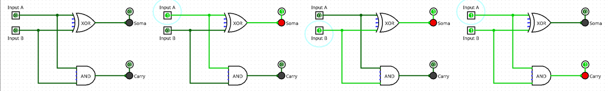
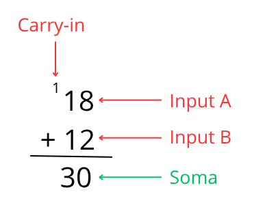
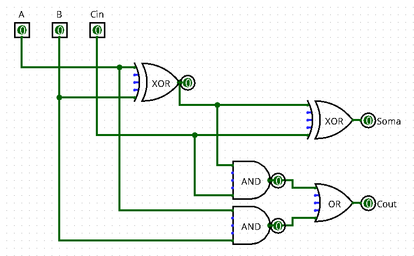
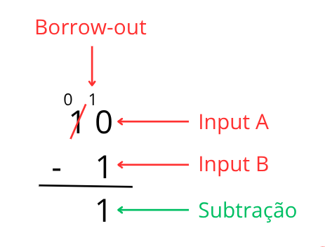
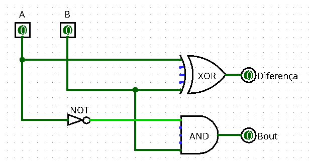
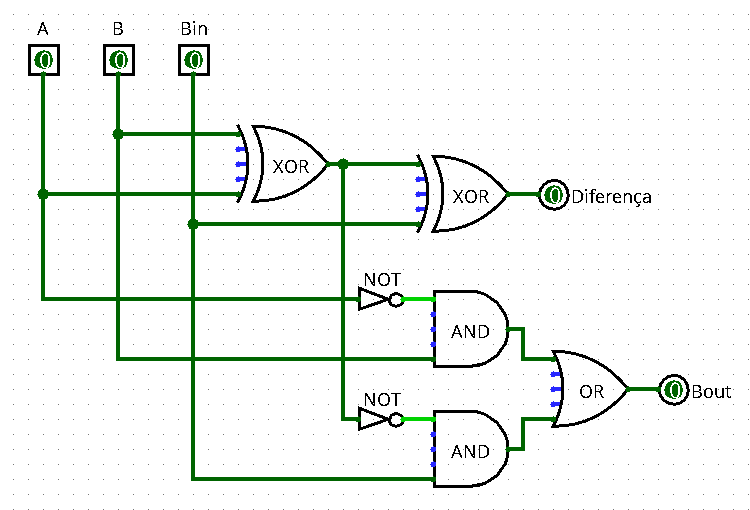
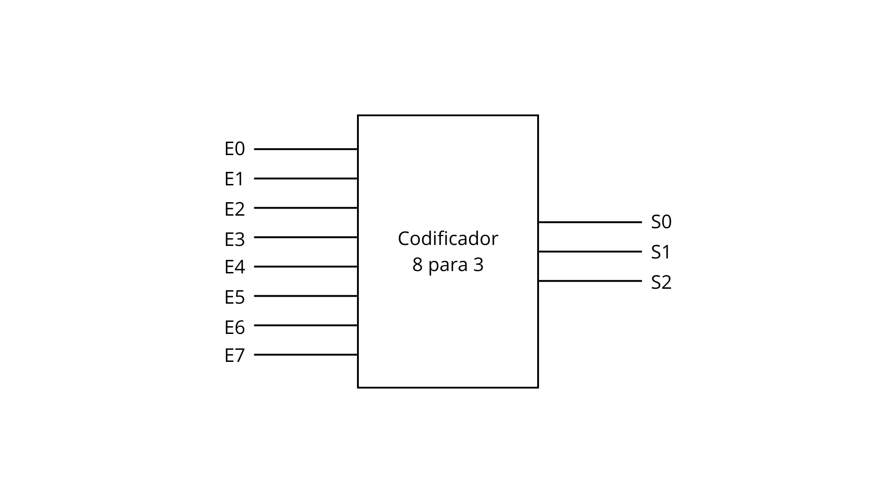
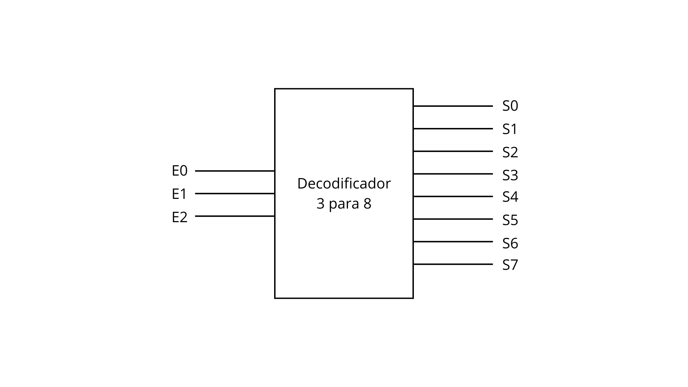

# Circuitos combinacionais

Circuitos combinacionais são conjuntos de portas lógicas nos quais a saída (o resultado) depende exclusivamente dos valores de entrada e da lógica geral do circuito.

Toda a base da computação e de processamento de qualquer computador é construída sobre circuitos combinacionais. De maneira básica, podemos utilizá-los para construir sistemas de lógica complexa (tomadas de decisões baseadas em condições) e processamento matemático, como, por exemplo, operações aritméticas da ULA, que permite ao hardware executar instruções de um software.

Neste módulo, veremos a construção de circuitos combinacionais básicos, como o meio-somador (half-adder), somador completo (full-adder) e subtratores. São circuitos compostos por poucas portas lógicas, mas que já permitem realizar operações matemáticas básicas.

## Meio Somador (half-adder)
Em poucas palavras, é um circuito digital que soma números binários. É o circuito somador mais simples que pode ser construído utilizando apenas duas portas lógicas: **XOR** e **AND**.

Para que seja possível representar um resultado, são necessários dois bits. O meio somador só pode somar 2 números de 1 bit cada, pois só possui 2 entradas de dados. Por conta disso, podemos realizar apenas 4 operações diferentes, onde o valor máximo resultante é 2 (10 em binário).

**Operações possíveis:**

---

Os casos são bem simples, apenas somas comuns. No último caso, quando a soma é $1 + 1$ e o resultado é 2 (10 em binário), o número 0 desce para o resultado enquanto o Carry, que é o valor da sobra da soma, é adicionado à próxima coluna do resultado, já que não possui outro valor para somá-lo junto.

Na matemática formal, o termo correto do Carry para esse processo é reagrupamento ou transporte. Mas também é chamado popularmente de "vai um".

Para representar os circuitos, vamos utilizar um programa chamado Logisim, que é uma ferramenta educacional de código aberto usada para projetar e simular circuitos lógicos digitais. Veja a construção do half-adder:

---

Agora veja os mesmos casos de soma representados acima:

---

Por fim, veja a tabela verdade do circuito:

<table style="width: 100%; max-width: 500px; text-align: center; border-collapse: collapse; margin: 20px auto; font-family: sans-serif;">
  <thead>
    <tr style="background-color: #707070; color: #ffffff;">
      <th style="padding: 12px; border: 1px solid #888888;">Input A</th>
      <th style="padding: 12px; border: 1px solid #888888;">Input B</th>
      <th style="padding: 12px; border: 1px solid #888888;">Carry</th>
      <th style="padding: 12px; border: 1px solid #888888;">Soma</th>
    </tr>
  </thead>
  <tbody>
    <tr style="background-color: white; color: #000;">
      <td style="padding: 12px; border: 1px solid #888888;">0</td>
      <td style="padding: 12px; border: 1px solid #888888;">0</td>
      <td style="padding: 12px; border: 1px solid #888888;">0</td>
      <td style="padding: 12px; border: 1px solid #888888; font-weight: bold;">0</td>
    </tr>
    <tr style="background-color: white; color: #000;">
      <td style="padding: 12px; border: 1px solid #888888;">0</td>
      <td style="padding: 12px; border: 1px solid #888888;">1</td>
      <td style="padding: 12px; border: 1px solid #888888;">0</td>
      <td style="padding: 12px; border: 1px solid #888888; font-weight: bold;">1</td>
    </tr>
    <tr style="background-color: white; color: #000;">
      <td style="padding: 12px; border: 1px solid #888888;">1</td>
      <td style="padding: 12px; border: 1px solid #888888;">0</td>
      <td style="padding: 12px; border: 1px solid #888888;">0</td>
      <td style="padding: 12px; border: 1px solid #888888; font-weight: bold;">1</td>
    </tr>
    <tr style="background-color: white; color: #000;">
      <td style="padding: 12px; border: 1px solid #888888;">1</td>
      <td style="padding: 12px; border: 1px solid #888888;">1</td>
      <td style="padding: 12px; border: 1px solid #888888;">1</td>
      <td style="padding: 12px; border: 1px solid #888888; font-weight: bold;">0</td>
    </tr>
  </tbody>
</table>

---

## Somador completo (full-adder)
A grande diferença é que o somador completo consegue somar 1 bit a mais, ou seja, 3 bits simultaneamente. Quando realizamos uma soma decimal comum (como $12 + 18$), começamos pelas unidades ($2 + 8 = 10$) e, nesse caso, o 0 desce para o resultado final e o 1 é transportado para se juntar à soma da próxima coluna.

Na matemática binária é a mesma coisa, pois quando existe um bit "vai um", é necessário realizar uma soma de 3 valores, e é nesse caso que entra o somador completo.

O circuito somador completo possui:
- **3 Entradas:**
  - $A$: o primeiro bit a ser somado.
  - $B$: o segundo bit a ser somado.
  - $C_{in}$ (Carry-in): o bit transportado da soma da coluna anterior.

- **2 Saídas:**
  - $S$ (Soma): o resultado final da soma atual.
  - $C_{out}$ (Carry-out): o bit que irá para a próxima coluna.

---

Veja a representação do exemplo em decimal:

---

Um somador completo é formado por dois meios-somadores e uma porta OR. As duas portas XOR são responsáveis por calcular a soma dos números. As duas portas AND são responsáveis por identificar se houve transporte (carry) das somas individuais. E, por fim, a porta OR é responsável por juntar os transportes e gerar o **Carry-out ($C_{out}$)** final. Veja a construção do circuito:

 

As equações lógicas booleanas que definem o circuito são:

$$S = A \oplus B \oplus C_{in}$$

$$C_{out} = (A \cdot B) + (C_{in} \cdot (A \oplus B))$$

**Tabela verdade**

<table style="width: 100%; max-width: 600px; text-align: center; border-collapse: collapse; margin: 20px auto; font-family: sans-serif;">
  <thead>
    <tr style="background-color: #707070; color: #ffffff;">
      <th style="padding: 12px; border: 1px solid #888888;">Input A</th>
      <th style="padding: 12px; border: 1px solid #888888;">Input B</th>
      <th style="padding: 12px; border: 1px solid #888888;">Carry-in (Cin)</th>
      <th style="padding: 12px; border: 1px solid #888888;">Soma (S)</th>
      <th style="padding: 12px; border: 1px solid #888888;">Carry-out (Cout)</th>
    </tr>
  </thead>
  <tbody>
    <tr style="background-color: white; color: #000;">
      <td style="padding: 12px; border: 1px solid #888888;">0</td>
      <td style="padding: 12px; border: 1px solid #888888;">0</td>
      <td style="padding: 12px; border: 1px solid #888888;">0</td>
      <td style="padding: 12px; border: 1px solid #888888; font-weight: bold;">0</td>
      <td style="padding: 12px; border: 1px solid #888888; font-weight: bold;">0</td>
    </tr>
    <tr style="background-color: white; color: #000;">
      <td style="padding: 12px; border: 1px solid #888888;">0</td>
      <td style="padding: 12px; border: 1px solid #888888;">1</td>
      <td style="padding: 12px; border: 1px solid #888888;">0</td>
      <td style="padding: 12px; border: 1px solid #888888; font-weight: bold;">1</td>
      <td style="padding: 12px; border: 1px solid #888888; font-weight: bold;">0</td>
    </tr>
    <tr style="background-color: white; color: #000;">
      <td style="padding: 12px; border: 1px solid #888888;">1</td>
      <td style="padding: 12px; border: 1px solid #888888;">0</td>
      <td style="padding: 12px; border: 1px solid #888888;">0</td>
      <td style="padding: 12px; border: 1px solid #888888; font-weight: bold;">1</td>
      <td style="padding: 12px; border: 1px solid #888888; font-weight: bold;">0</td>
    </tr>
    <tr style="background-color: white; color: #000;">
      <td style="padding: 12px; border: 1px solid #888888;">1</td>
      <td style="padding: 12px; border: 1px solid #888888;">1</td>
      <td style="padding: 12px; border: 1px solid #888888;">0</td>
      <td style="padding: 12px; border: 1px solid #888888; font-weight: bold;">0</td>
      <td style="padding: 12px; border: 1px solid #888888; font-weight: bold;">1</td>
    </tr>
    <tr style="background-color: white; color: #000;">
      <td style="padding: 12px; border: 1px solid #888888;">0</td>
      <td style="padding: 12px; border: 1px solid #888888;">0</td>
      <td style="padding: 12px; border: 1px solid #888888;">1</td>
      <td style="padding: 12px; border: 1px solid #888888; font-weight: bold;">1</td>
      <td style="padding: 12px; border: 1px solid #888888; font-weight: bold;">0</td>
    </tr>
    <tr style="background-color: white; color: #000;">
      <td style="padding: 12px; border: 1px solid #888888;">0</td>
      <td style="padding: 12px; border: 1px solid #888888;">1</td>
      <td style="padding: 12px; border: 1px solid #888888;">1</td>
      <td style="padding: 12px; border: 1px solid #888888; font-weight: bold;">0</td>
      <td style="padding: 12px; border: 1px solid #888888; font-weight: bold;">1</td>
    </tr>
    <tr style="background-color: white; color: #000;">
      <td style="padding: 12px; border: 1px solid #888888;">1</td>
      <td style="padding: 12px; border: 1px solid #888888;">0</td>
      <td style="padding: 12px; border: 1px solid #888888;">1</td>
      <td style="padding: 12px; border: 1px solid #888888; font-weight: bold;">0</td>
      <td style="padding: 12px; border: 1px solid #888888; font-weight: bold;">1</td>
    </tr>
    <tr style="background-color: white; color: #000;">
      <td style="padding: 12px; border: 1px solid #888888;">1</td>
      <td style="padding: 12px; border: 1px solid #888888;">1</td>
      <td style="padding: 12px; border: 1px solid #888888;">1</td>
      <td style="padding: 12px; border: 1px solid #888888; font-weight: bold;">1</td>
      <td style="padding: 12px; border: 1px solid #888888; font-weight: bold;">1</td>
    </tr>
  </tbody>
</table>

---

## Subtratores
A lógica dos subtratores é bem semelhante à dos somadores, porém, em vez de acumular valores e gerar um carry, nós retiramos valores. É o conceito de "pedir emprestado", que é conhecido como **Borrow**.

### Meio subtrator (half-subtractor)
É o circuito que faz a subtração de dois bits ($A - B$), onde $A$ é o minuendo e $B$ é o subtraendo. As suas saídas são: $D$ (diferença), que é o resultado da subtração, e o $B_{out}$ (Borrow-out), que indica se o bit $A$ precisou "pedir emprestado" da próxima coluna porque $B$ era maior do que ele (ou seja, quando tentamos fazer $0 - 1$).

Assim como na matemática com números decimais, quando tentamos subtrair $10 - 1$, a coluna da esquerda "empresta" 1 para a coluna da direita. Ela se torna 0 e a coluna da direita se torna $10$.

Agora veja a equação do meio subtrator:

$$D = A \oplus B$$

$$B_{out} = \bar{A} \cdot B$$

Veja o exemplo com matemática decimal:

 

> O meio subtrator utiliza apenas 2 bits para a subtração, então tecnicamente o valor que foi pego emprestado não irá fazer diferença na subtração da coluna atual, mas fará para as colunas seguintes. O resultado se torna 1 por conta da lógica booleana da porta XOR.

Um meio subtrator utiliza 3 portas lógicas, que são: 1 porta XOR, 1 porta NOT e uma porta AND. Veja o circuito montado:

 

Vamos deixar 2 conceitos bem definidos:
- **Borrow-out**: é a necessidade da coluna atual de obter um valor emprestado da próxima coluna.
- **Borrow-in**: é a mesma dívida, porém do ponto de vista da coluna que realizou o empréstimo.

> Quando a coluna não possui um valor suficiente para emprestar, ocorre o que chamamos de efeito dominó (ou em cascata), onde o Borrow-in vai passando de coluna em coluna até encontrar alguma que possa realizar o empréstimo.

### Subtrator completo (full-subtractor)
Assim como o somador completo, o subtrator completo realiza o cálculo utilizando 3 bits de entrada e gera 2 bits de saída. Ele é construído utilizando dois meios-subtratores e uma porta OR.

**Primeiro Meio Subtrator:** A porta XOR realiza a primeira subtração parcial ($A \oplus B$). A porta AND com a entrada invertida verifica se $A < B$ para gerar um primeiro sinal de empréstimo parcial.

**Segundo Meio Subtrator:** Recebe o resultado da XOR do primeiro bloco e a entrada $B_{in}$. A segunda subtração é realizada: $(\text{Resultado Parcial}) \oplus B_{in}$. A saída aqui já é a Diferença final (D). A porta AND interna verifica se o resultado parcial era menor que $B_{in}$ para gerar um segundo sinal de empréstimo parcial.

Por fim, a porta OR recebe os sinais de empréstimo dos dois blocos. Se o primeiro bloco precisou de empréstimo OU o segundo bloco precisou de empréstimo, ela joga 1 no pino $B_{out}$ global.

Veja as equações que representam o circuito:

$$D = A \oplus B \oplus B_{in}$$

$$B_{out} = (\bar{A} \cdot B) + (\overline{(A \oplus B)} \cdot B_{in})$$

 

**Tabela verdade**

<table style="width: 100%; max-width: 700px; text-align: center; border-collapse: collapse; margin: 20px auto; font-family: sans-serif;">
  <thead>
    <tr style="background-color: #707070; color: #ffffff;">
      <th style="padding: 12px; border: 1px solid #888888;">Input A</th>
      <th style="padding: 12px; border: 1px solid #888888;">Input B</th>
      <th style="padding: 12px; border: 1px solid #888888;">Empréstimo de entrada (Bin)</th>
      <th style="padding: 12px; border: 1px solid #888888;">Diferença (D)</th>
      <th style="padding: 12px; border: 1px solid #888888;">Empréstimo de saída (Bout)</th>
    </tr>
  </thead>
  <tbody>
    <tr style="background-color: white; color: #000;">
      <td style="padding: 12px; border: 1px solid #888888;">0</td>
      <td style="padding: 12px; border: 1px solid #888888;">0</td>
      <td style="padding: 12px; border: 1px solid #888888;">0</td>
      <td style="padding: 12px; border: 1px solid #888888; font-weight: bold;">0</td>
      <td style="padding: 12px; border: 1px solid #888888; font-weight: bold;">0</td>
    </tr>
    <tr style="background-color: white; color: #000;">
      <td style="padding: 12px; border: 1px solid #888888;">0</td>
      <td style="padding: 12px; border: 1px solid #888888;">0</td>
      <td style="padding: 12px; border: 1px solid #888888;">1</td>
      <td style="padding: 12px; border: 1px solid #888888; font-weight: bold;">1</td>
      <td style="padding: 12px; border: 1px solid #888888; font-weight: bold;">1</td>
    </tr>
    <tr style="background-color: white; color: #000;">
      <td style="padding: 12px; border: 1px solid #888888;">0</td>
      <td style="padding: 12px; border: 1px solid #888888;">1</td>
      <td style="padding: 12px; border: 1px solid #888888;">0</td>
      <td style="padding: 12px; border: 1px solid #888888; font-weight: bold;">1</td>
      <td style="padding: 12px; border: 1px solid #888888; font-weight: bold;">1</td>
    </tr>
    <tr style="background-color: white; color: #000;">
      <td style="padding: 12px; border: 1px solid #888888;">0</td>
      <td style="padding: 12px; border: 1px solid #888888;">1</td>
      <td style="padding: 12px; border: 1px solid #888888;">1</td>
      <td style="padding: 12px; border: 1px solid #888888; font-weight: bold;">0</td>
      <td style="padding: 12px; border: 1px solid #888888; font-weight: bold;">1</td>
    </tr>
    <tr style="background-color: white; color: #000;">
      <td style="padding: 12px; border: 1px solid #888888;">1</td>
      <td style="padding: 12px; border: 1px solid #888888;">0</td>
      <td style="padding: 12px; border: 1px solid #888888;">0</td>
      <td style="padding: 12px; border: 1px solid #888888; font-weight: bold;">1</td>
      <td style="padding: 12px; border: 1px solid #888888; font-weight: bold;">0</td>
    </tr>
    <tr style="background-color: white; color: #000;">
      <td style="padding: 12px; border: 1px solid #888888;">1</td>
      <td style="padding: 12px; border: 1px solid #888888;">0</td>
      <td style="padding: 12px; border: 1px solid #888888;">1</td>
      <td style="padding: 12px; border: 1px solid #888888; font-weight: bold;">0</td>
      <td style="padding: 12px; border: 1px solid #888888; font-weight: bold;">0</td>
    </tr>
    <tr style="background-color: white; color: #000;">
      <td style="padding: 12px; border: 1px solid #888888;">1</td>
      <td style="padding: 12px; border: 1px solid #888888;">1</td>
      <td style="padding: 12px; border: 1px solid #888888;">0</td>
      <td style="padding: 12px; border: 1px solid #888888; font-weight: bold;">0</td>
      <td style="padding: 12px; border: 1px solid #888888; font-weight: bold;">0</td>
    </tr>
    <tr style="background-color: white; color: #000;">
      <td style="padding: 12px; border: 1px solid #888888;">1</td>
      <td style="padding: 12px; border: 1px solid #888888;">1</td>
      <td style="padding: 12px; border: 1px solid #888888;">1</td>
      <td style="padding: 12px; border: 1px solid #888888; font-weight: bold;">1</td>
      <td style="padding: 12px; border: 1px solid #888888; font-weight: bold;">1</td>
    </tr>
  </tbody>
</table>

> **Fique atento à ordem na hora de conferir a tabela:** Na linha 2, temos $A=0$, $B=0$ e $B_{in}=1$. A conta realizada é $(A - B) - B_{in}$. Portanto: $(0 - 0) - 1 = -1$. Em binário de 1 bit, o valor $-1$ é representado com a Diferença ($D$) em `1` e o Empréstimo ($B_{out}$) em `1` (indicando que foi necessário pedir um bit de peso 2 emprestado para a coluna da esquerda).

---

## Codificadores

Codificadores são circuitos lógicos combinacionais que possuem até $2^n$ linhas de entrada e $n$ linhas de saída. São responsáveis por converter um sinal ativo em uma de suas entradas no código binário correspondente em suas saídas.

Existem diversos tipos de codificadores, mas, independentemente do modelo, a função fundamental de qualquer codificador digital é receber múltiplos sinais de entrada e compactá-los em um código binário menor e padronizado que possa ser interpretado pelo processador.

Os codificadores estão presentes em diversas partes de um computador, principalmente em circuitos integrados na placa-mãe ou dentro do próprio processador. Os locais mais comuns onde são encontrados incluem:

* Periféricos de entrada;
* Unidade Lógica e Aritmética (ULA / ALU);
* Sistemas de comunicação e conversão de dados.

Antes de citarmos os diferentes tipos de codificadores, veja um exemplo simplificado para ilustrar seu funcionamento:

Imagine um teclado fictício com 104 teclas, no qual cada tecla possui um fio conectado diretamente a uma das entradas do codificador (resultando em 104 linhas de entrada). 

Supondo que as 10 primeiras teclas correspondam aos números de 0 a 9, se o usuário pressionar a tecla número 1, apenas a linha referente a essa tecla ficará com sinal elétrico ativo (`1`), enquanto todas as outras permanecerão inativas (`0`).

Para que as saídas do codificador consigam representar todas as 104 entradas possíveis, a saída precisa ter pelo menos 7 bits, permitindo até $2^7 = 128$ combinações diferentes. Assim, o sinal recebido na entrada ativa é comprimido e convertido para a representação binária do número 1, que em 7 bits é $0000001$.

>**Nota:** Quando você pressiona uma tecla em um teclado real, ele não envia diretamente um caractere, mas sim a posição física daquela tecla, conhecida como *Scan Code*. O sistema operacional é o responsável por interpretar esse endereço e traduzi-lo na letra ou símbolo correspondente, com base no layout configurado.

>**Nota:** É importante ressaltar que, teclados reais utilizam uma matriz de teclas (varredura de linhas e colunas) controlada por um microcontrolador, evitando a necessidade de utilizar 104 condutores individuais. O exemplo acima é só uma forma de simplificar a explicação.

Veja a representação de um Codificador:

---

É importante destacar também os dois modos fundamentais de transmissão de dados:

* **Transmissão paralela:** O codificador disponibiliza todos os bits de saída ao mesmo tempo através de múltiplas vias (por exemplo, 8 linhas de saída). A desvantagem é a necessidade de um barramento físico com mais fios conectados à placa-mãe.
* **Transmissão em série:** Os bits gerados em paralelo pelo codificador são capturados por um circuito interno (como um registrador de deslocamento ou chip serializador) e colocados em uma fila. Em seguida, esse circuito envia os bits de forma sequencial, um por um, utilizando um único fio de sinal (como ocorre nos cabos USB).

Os principais tipos de codificadores são:

* **Codificador binário simples ($2^n \to n$):** Modelo padrão utilizado em circuitos onde apenas uma linha de entrada é acionada por vez, como em seletores manuais ou chaves simples.
* **Codificador de prioridade:** Evolução do modelo simples que resolve conflitos do mundo real. Caso duas ou mais entradas sejam acionadas simultaneamente, o circuito codifica apenas a entrada que possui a maior prioridade.
* **Codificador BCD (Decimal Codificado em Binário):** Tipo específico que converte 10 entradas decimais (dígitos de 0 a 9) em um código binário BCD de 4 bits.
* **Serializador (Codificador Paralelo-Série):** Circuito que recebe um dado binário fornecido em paralelo e o reorganiza em uma sequência contínua de bits para transmissão através de um único condutor.

---

## Decodificadores

Como vimos anteriormente, enquanto os codificadores recebem informações dispersas e as comprimem em um código binário compacto, o decodificador faz o caminho oposto: ele recebe o código binário compacto e o traduz (ou "descomprime") para acionar um componente específico no mundo físico ou dentro do próprio processador.

Trata-se também de um circuito combinacional essencial, cuja função principal é converter informações codificadas de um formato binário de $n$ linhas de entrada para até $2^n$ linhas de saída.

Considerando o exemplo simplificado do teclado, o decodificador opera de forma inversamente proporcional: a CPU envia os bits codificados e, ao recebê-los, o decodificador ativa exatamente o fio correspondente àquela tecla. Em outras palavras, enquanto o codificador opera na relação "de muitos para poucos", o decodificador atua "de poucos para muitos".

Os decodificadores são comuns:

* **Dentro do Processador:** Suponha que um programa de calculadora envie uma instrução para a CPU com o binário `01001100` (que representa a operação de SOMAR). Esse código entra no **Decodificador de Instruções** da CPU que, ao interpretá-lo, ativa eletricamente apenas o circuito interno responsável pela soma (a ULA / ALU), mantendo desligados os circuitos de multiplicação, divisão, entre outros.
* **Na Memória RAM:** O **Decodificador de Endereço** (*address decoder*) é utilizado quando a CPU precisa ler um espaço na memória RAM. A CPU envia o endereço desejado através do barramento de endereços; o decodificador lê esse código e ativa unicamente a célula de memória correspondente a esse endereço.

Veja a representação de um Codificador:

---

Para fixar ambos os conceitos de maneira simples:

* **Codificador:** Transforma um sinal físico (vindo de um periférico ou do próprio hardware) em um código compacto de bits que a CPU compreende.
* **Decodificador:** Transforma o código binário enviado pela CPU em um sinal elétrico direto, com a finalidade de executar uma instrução, selecionar um espaço na memória RAM ou acender um LED/display específico.

Principais Tipos de Decodificadores:

* **Decodificador Binário Simples ($n \to 2^n$):** Executa o processo inverso ao codificador simples. É utilizado no roteamento básico de sinais e na seleção de circuitos lógicos, onde uma combinação binária ativa um componente específico e mantém todos os outros desligados.
* **Decodificador de Endereço (*Address Decoder*):** Decodificador de grande escala integrado em placas de memória (RAM/ROM) e barramentos da placa-mãe. A CPU envia o endereço de uma posição de memória em binário, e o decodificador lê essa informação e ativa eletricamente apenas aquela célula ou chip para leitura ou escrita.
* **Decodificador BCD para 7 Segmentos (ex: CI 74LS47):** Decodificador especializado que traduz um número em código BCD de 4 bits (de $0000$ a $1001$, representando de 0 a 9) nas conexões elétricas necessárias para acionar um display de 7 segmentos. Muito utilizado em painéis numéricos e relógios digitais.
* **Decodificador de Instruções (*Instruction Decoder*):** Circuito lógico localizado na Unidade de Controle (UC) do processador. Quando a CPU busca uma instrução na memória, este decodificador interpreta o código binário e configura os caminhos internos da CPU, ativando os blocos corretos (como a ULA) para executar a tarefa.